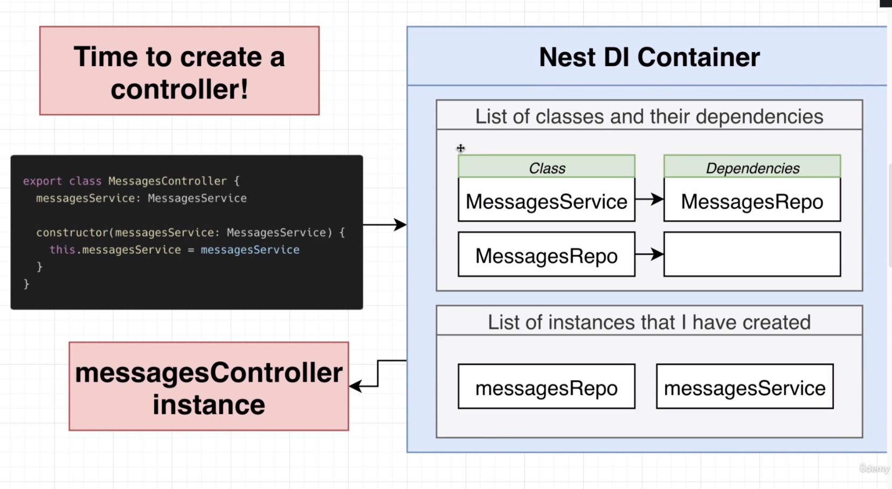
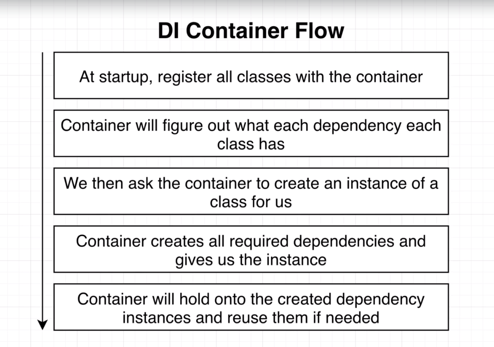
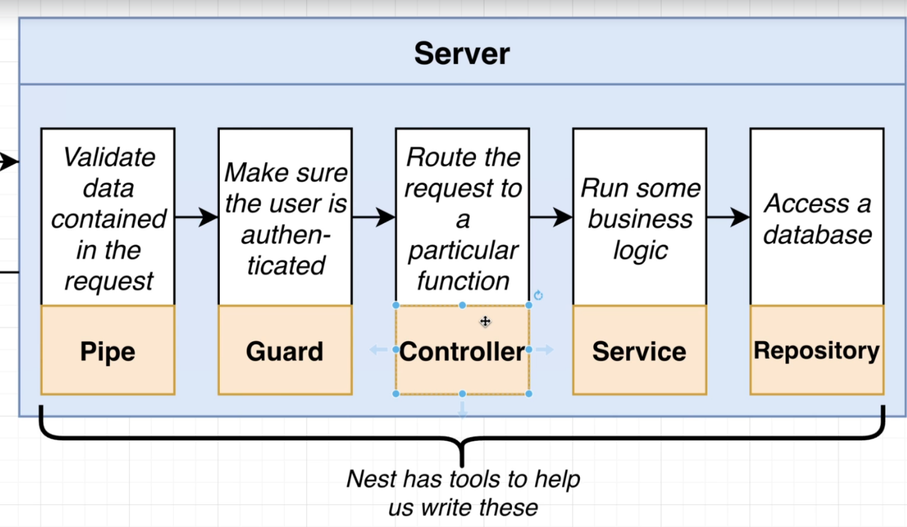
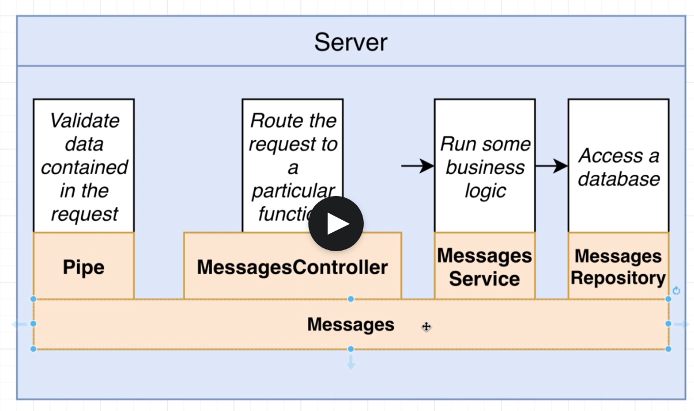

## Install nest cli

```
npm i -g @nestjs/cli
```

## Generate new nest project

```
nest new <name>
```

## Start Deving

```
npm run start:dev
```

## CLI options for generating modules/controllers

```
nest generate module <module-name>

# --flat so we don't create a new folder inside the `messages` folder
nest generate controller messages/messages --flat
```

## Setting up Automatic Validation

There are 4 steps to setting up automatic validation with Nesjs

1. Tell Nest to use global validation
2. Create a class that describes the different properties that the request body should have. (Data Transfer Object or DTS)
3. Add validation rules to the class
4. Apply that class to the request handler

## Data Transfer Object (DTOs)

The goal of a `DTO` is to carry data between two places. They are simply a class to describe what data looks like as it is being transfered.

## Services and Repositiories

| Services                                              |                             Repositiories                             |
| :---------------------------------------------------- | :-------------------------------------------------------------------: |
| Its a class                                           |                              Its a class                              |
| #1 Place to put any business logic                    |                 #1 place to put storage-related logic                 |
| Uses one or more Repositiories to find and store data | Usually ends up being a TypeORM entity, a Mongoose schema, or similar |

Example:

| MessageService            |     MessageRepository     |
| :------------------------ | :-----------------------: |
| `findOne(id: string)`     |   `findOne(id: string)`   |
| `findAll()`               |        `findAll()`        |
| `create(message: string)` | `create(message: string)` |

## Dependency Injection

Allows us to use the Inversion of Control principle without having to create all the deps ourselves.  



General Flow:



_______________________________________________________

## Nest JS Server Tools Diagram



_______________________________________________________

## Example Module Diagram



_______________________________________________________
